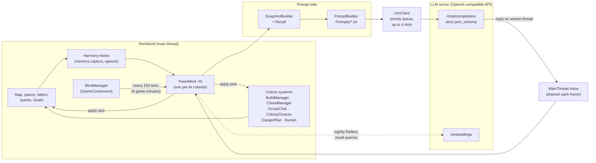
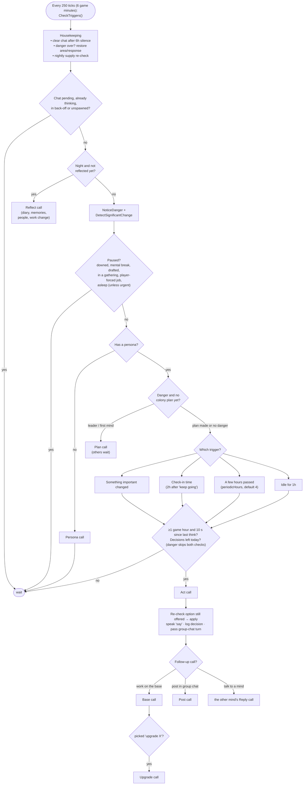
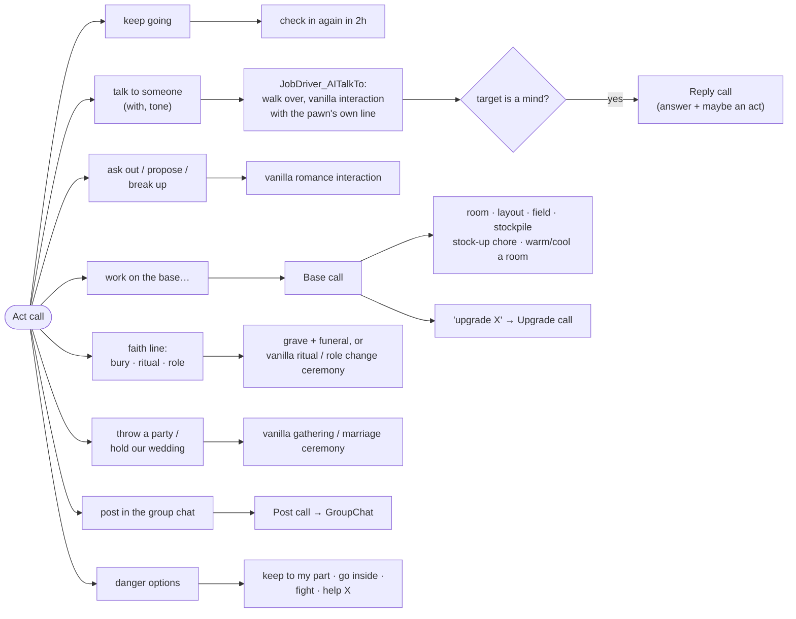
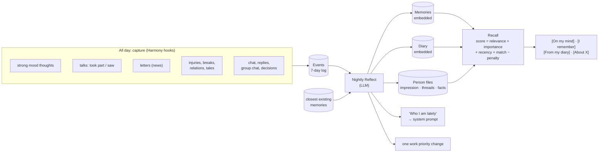
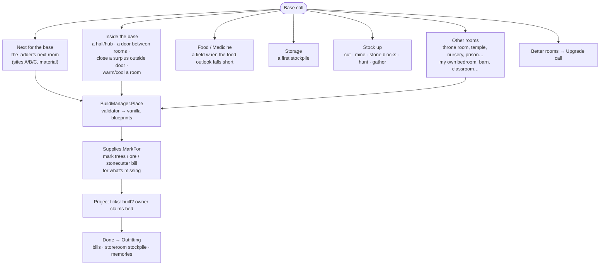
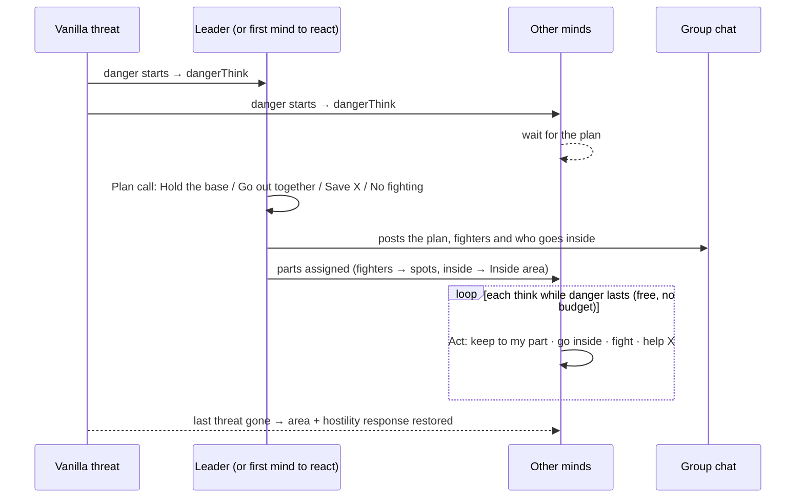
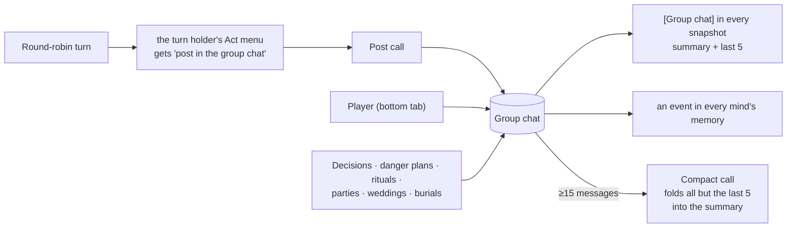
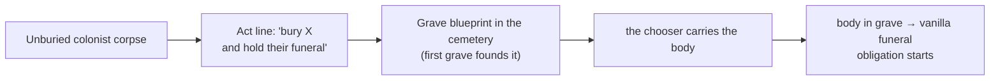

# AI Pawn Control

A RimWorld 1.6 mod that gives colonists their own mind. An LLM decides what an "AI mind" colonist
does, says and remembers. It can be any OpenAI-compatible server, local or remote. Each mind:

- has a persona;
- keeps long-term memory and a nightly diary;
- talks to the player and to the other minds;
- grows the base;
- reacts to danger as a group;
- takes part in the colony's customs.

The long-term goal is a village that runs itself.

The game still does the work. Minds pick *what* matters. Vanilla RimWorld handles *how*: jobs,
pathing, building, rituals. Every pick a mind makes becomes a normal vanilla order, blueprint, bill,
zone or ritual. The player can see each one and undo it.

---

## Contents
1. [The big picture](#1-the-big-picture)
2. [The agent cycle](#2-the-agent-cycle)
3. [The Act menu and what each choice leads to](#3-the-act-menu-and-what-each-choice-leads-to)
4. [All LLM calls](#4-all-llm-calls)
5. [What a mind sees: the snapshot](#5-what-a-mind-sees-the-snapshot)
6. [Memory](#6-memory)
7. [Building the base](#7-building-the-base)
8. [Chores and stock-ups](#8-chores-and-stock-ups)
9. [Danger](#9-danger)
10. [Group chat](#10-group-chat)
11. [Colony choices](#11-colony-choices)
12. [Ideology, gatherings and burials](#12-ideology-gatherings-and-burials)
13. [Player UI and settings](#13-player-ui-and-settings)
14. [Repository layout](#14-repository-layout)
15. [Build and dev loop](#15-build-and-dev-loop)
16. [Design principles](#16-design-principles)

---

## 1. The big picture



- **One `PawnMind` per AI colonist.** It is saved with the game: persona, memory, decisions,
  chat history and danger settings.
- **Everything that changes the world runs on the main thread.** LLM replies come back on a worker
  thread and are posted to `MainThread`, which a `Root.Update` postfix drains every frame.
- **Each reply is checked again before it's applied** (see [stale drops](#gates-and-guards)).
  The world may have changed while the model was thinking.

---

## 2. The agent cycle

`MindManager` runs every mind's `CheckTriggers()` every 250 ticks (6 in-game minutes). This is game
time, so it stops while the game is paused. A separate per-frame update handles player chat and
replies to other minds, and it keeps running while paused. [Game time vs real time](#game-time-vs-real-time)
explains what these durations look like in play.



### Game time vs real time

A **tick** is RimWorld's unit of game time: the simulation advances one step per tick. Durations
in this README are game time unless they say "real". Game time stops while paused, and the speed
buttons change how fast it passes.

| Game time | Ticks | at 1× (Normal, 60 ticks/s) | at 3× (Fast, 180/s) | at 6× (Superfast, 360/s) |
|---|---|---|---|---|
| 250 ticks (one trigger check) | 250 | ~4 s | ~1.4 s | ~0.7 s |
| 1 game hour | 2,500 | ~42 s | ~14 s | ~7 s |
| 2 game hours (check-in, cooldowns) | 5,000 | ~1.4 min | ~28 s | ~14 s |
| 4 game hours (periodic think) | 10,000 | ~2.8 min | ~56 s | ~28 s |
| 1 game day | 60,000 | ~17 min | ~5.6 min | ~2.8 min |

- When nothing is happening on the map, Superfast doubles to 720 ticks/s. The dev-only Ultrafast
  speed is faster still.
- These are target rates. A busy colony or a slow PC can run fewer ticks per second.
- **Real-time rules** don't change with game speed: the 10 s minimum between a mind's thinks, the
  colony-choice scan every 2 s, and the LLM request timeout.
- An LLM reply takes real time, but the game keeps running. A 5 s reply at Superfast is about 1,800
  ticks, which is most of a game hour. That's why replies are re-checked before they're applied.

### Triggers for an Act

The first trigger that matches wins. Its text goes into `act.txt` as `{trigger}`.

| Trigger | Fires when | Wakes a sleeper? |
|---|---|---|
| **Something important just changed.** | Danger starts, the first time each colonist is hurt during danger, the map's danger rating rises, the pawn gets a new visible injury, or the pawn's mood band drops (awake only) | yes, except for mood |
| **It's time to check in, like I planned.** | 2 h after the pawn picked "keep going" | no |
| **A few hours have passed.** | `periodicHours` (4) have passed since any call, with no check-in planned | no |
| **I've been idle for a while.** | 1 h without a job | no |
| *(dev)* Think now | Debug action or gizmo; ignores cooldowns and the budget | n/a |

### Gates and guards

- **Daily budget:** `actsPerDay` (default 10) Acts per local day.
  - Danger Acts are free and still run when the budget is at 0.
  - Each action in a Reply costs 1. An action from a player Chat is free.
  - A Base call with nothing to offer gives the decision back.
- **Spacing:** at least 1 game hour and 10 real seconds between thinks. Danger skips the hour.
- **Back-off:** 3 failures in a row (HTTP error, timeout, empty or invalid reply, a pick not on the
  menu) → 2 game hours of rest. The Mind tab shows "Unreachable".
- **Stale drops:** each mind has only one request in flight, and a new request cancels the old one.
  A reply is dropped when:
  - the game changed (another save was loaded);
  - the call's own validity check fails (pawn gone, paused, choice closed, danger over…);
  - for an Act, the picked option is no longer on a menu rebuilt at that moment.
- **Queue:** `LlmClient` runs up to `parallelRequests` (default 4) at once. The rest wait by priority:

  | Priority | Calls |
  |---|---|
  | 0 | chat |
  | 1 | reply, decide, plan |
  | 2 | act, upgrade |
  | 3 | base, post |
  | 4 | persona |
  | 5 | reflect, compact |

---

## 3. The Act menu and what each choice leads to

The Act prompt is a numbered menu built fresh by `ActionCatalog.BuildActMenu`. An option only
appears when it's possible right now. Unavailable options are hidden, never explained.



| Option | When it's offered | What happens |
|---|---|---|
| **keep going** (job report) | Always | Carries on with vanilla's work. Plans a check-in 2 h later. During danger with a plan part, it reads "keep to my part in the plan (…)". |
| **talk to someone** | Not in Chat/Reply; up to 5 awake colonists within 12 tiles | `with` picks the person and `tone` (positive/negative) the mood. Vanilla's weights pick the interaction, and the pawn's `say` is the line in the log and bubble. If the target is a mind, it answers with a **Reply** call. Cooldowns: 4 h per pair, a negative talk once a day, life-changing talks every 7 days. |
| **ask X out / propose to X / break up with X** | Vanilla's selection weight > 0 and off cooldown | The vanilla romance interaction. |
| **work on the base: …** | `BaseCall.AnythingToDo` | Opens the **Base call** ([§7](#7-building-the-base)). While a project runs, the label reads "(X's barracks comes first)". |
| **faith line** (at most one) | The `gatherings` setting is on; home map | Priority order: a burial, a due ritual obligation, a role, then an anytime ritual. See [§12](#12-ideology-gatherings-and-burials). |
| **throw a party / hold our wedding** | Vanilla allows it now | Starts vanilla's gathering or marriage ceremony and posts it to the group chat. |
| **post in the group chat** | Only the mind whose turn it is (round robin) | Opens the **Post call** ([§10](#10-group-chat)). |
| **go inside / fight / help X** | Only while there's a threat. Danger replaces the rest of the menu. | See [§9](#9-danger). |

Every Act reply also returns:
- `say`: a remark spoken out loud as a bubble, or "" for silence;
- `memory`: the memory from `[On my mind]` that shaped the choice, if any.

---

## 4. All LLM calls

Every call except Persona and Compact gets a **system prompt**: `system.txt`, filled with the pawn's name,
persona and `guidance.txt`, plus its `[Who I am lately]`. All replies use a strict
`json_schema`. Thinking is off by default (`reasoning_effort: "none"`).

| Call | Template | Fired by | Returns | Result |
|---|---|---|---|---|
| **Persona** | `persona.txt` | first think with no persona; dev "Regenerate" | `persona` | 2-3 sentences with one big want, built from a passion and a trait. Then the pawn's starting work priorities are set from its passions. |
| **Act** | `act.txt` (+ `danger.txt` during danger) | the triggers in §2 | `reason, choice, with, tone, say, memory` | Applies the pick. |
| **Chat** | `chat.txt` | the player types in the Mind tab | `act, reply, memory` | The reply goes to the chat and memory, and the pawn may act from the menu. Wakes a sleeper. |
| **Reply** | `reply.txt` | another mind talked to the pawn with a line | `act, reply, memory` | The answer is spoken, both minds remember it, and the pawn may act (costs 1 decision). |
| **Base** | `base.txt` | Act → "work on the base" | `reason, choice, site, material, say` | A room, layout change, field, stockpile, stock-up chore, temperature item, or Upgrade call. |
| **Upgrade** | `upgrade.txt` | Base → "upgrade X" | `reason, choice, say` | A furnishing or floor project. |
| **Post** | `post.txt` | Act → "post in the group chat" | `reason, post` | A message in the group chat. |
| **Reflect** | `reflect.txt` | once a night | `diary, lately, memories[], people[], work` | Memory written and embedded; one work priority changed. |
| **Decide** | `decide.txt` | an open colony choice | `reason, choice, say` | The choice is applied and posted to the group chat. |
| **Plan** | `plan.txt` | danger starts | `reason, plan, fighters[], inside[], say` | Everyone gets their part; posted to the group chat. |
| **Compact** | `compact.txt` | group chat has 15+ messages | `summary` | Older messages are folded into the summary. |

The templates in `Prompts/` are loaded at runtime. Edit one and use the debug action **Reload
prompts**; no rebuild is needed. Every prompt and reply is logged to
`<savedata>/AIPawnControl/prompts-YYYY-MM-DD.jsonl`.

---

## 5. What a mind sees: the snapshot

`SnapshotBuilder` writes the live world as labelled sections, built fresh for each call.
The mind only knows what these show, and every mind knows the whole map.

| Section | Holds |
|---|---|
| `[Me]` | name, age, gender, backstory, traits, top skills and passions, ideoligion role, the pawn's rooms |
| `[Time]` | date, time, weather, outdoor temperature, the room the pawn is in |
| `[Condition]` | mental break, health, injuries, pain, bleeding, mood in words |
| `[Needs]` / `[Feelings]` | needs under 25%; the top 3 mood thoughts |
| `[Doing now]` / `[My project]` | job report; the pawn's build project's status |
| `[People]` | up to 10 colonists, nearest first: relation, role, opinion, mood, where, best skills, job; for a mind, also its project and last chore |
| `[Colony customs]` | the customs that give moods; "I don't follow them"; "One can be changed now" |
| `[Colony]` | headcount, danger rating, the dead, alerts, the base ladder's next step, food outlook |
| `[Colony stores]` | food days, medicine, wood, steel, components, silver, waiting to be hauled |
| `[Colony work]` | fields, stockpiles, marked targets, work orders, with "(by me)" on the pawn's own |
| `[Rooms]` | the room the pawn is in, then up to 12 others: impressiveness, temperature, builder, furniture |
| `[Recent]` | the pawn's last 5 decisions |
| `[Group chat]` | the summary, then the last 5 messages |
| `[Danger]` | only during threats: enemies, who they're after, the pawn's weapon, who's armed, the plan and the pawn's part |
| memory sections | `[Since yesterday]`, `[About X]`, `[On my mind]`, `[I remember]`, `[From my diary]` (see §6) |

Which call gets which sections:

| Call | Sections |
|---|---|
| Act | full snapshot + Since yesterday, About, On my mind |
| Chat, Reply | full snapshot + Since yesterday, About, I remember, From my diary |
| Post | full snapshot + Since yesterday, About |
| Base, Decide, Plan | full snapshot + Since yesterday |
| Reflect | Me, Time, Colony customs |
| Upgrade | Me, Time, Condition, Feelings |

When a prompt runs over its ~80k-character budget, memory sections are dropped first, starting with
the diary.

---

## 6. Memory



**Stores** (`MindMemory`, saved in the game save; nothing external):

| Store | What it is |
|---|---|
| **Events** | The raw log, with source `took_part`, `saw`, `news`, `told` or `player_said`. Repeats within 2 h merge as "×N". Kept 7 days and never embedded. |
| **Memories** | Written only by Reflect, in the pawn's voice (≤200 chars, importance 1-10, cites events). Near-duplicates (cosine ≥ 0.81) merge each night. Old trivial memories nobody used are archived. |
| **Diary** | One entry per night, embedded. |
| **Person files** | One per name, plus "the player" and "colony". Each holds an impression, open threads, up to 5 facts with a source and a since/until, and which memories the pawn has already told them. |
| **Lately** | ≤600 chars about how the pawn has been. Rewritten nightly and added to every system prompt. |

**Nightly Reflect** runs the first time the pawn is asleep after 22:00, or at 02:00 if it's awake. A
missed night is made up later; a quiet day is skipped. A chat or a reply cancels it, and it runs
again later. It gets:
- up to 40 events since the last Reflect;
- the people involved, with the pawn's opinions and files;
- `[Work waiting]` (what piled up since last night) and the pawn's work priorities;
- the closest existing memories.

The code guards the reply:
- memories must cite real events;
- a retelling of events already in one memory is skipped;
- importance can't drop more than 2 below its events'.

**Recall** scores each memory as relevance (embedding cosine) + importance + recency (14-day decay)
+ person or place match − a penalty (shown in the last 6 h, or already told to this listener).
Picks are kept varied. When a reply cites a memory, that memory counts as used and is noted as told to that
person.

**Embeddings** go to `{embedEndpoint}/embeddings` (default model `google/embedding-gemma-300m`).
- Prefixes depend on the model (gemma, nomic).
- Vectors are cut to 256, L2-normalised, tagged `model|dims` and stored as base64.
- If embeddings are unavailable, recall ranks by importance, recency and match only.

---

## 7. Building the base

### The Base call

"Work on the base" opens a menu from `BaseCall.Prepare`, in these groups:



**Rules for placing a room:**
- **One project at a time** on the map, upgrades included, **with one exception:** the ladder's next
  room can still be placed while another project runs, if storage already holds everything it costs.
  Only those materials are offered for it.
- A mind can place again only 2 h after its last project.
- A scan that finds no site waits 2 days before trying again.

While a project runs, the menu also still offers warming or cooling a room, fields and stock-ups.
Hubs, doors between rooms, other rooms and upgrades wait until the project is done.

**The ladder** (`Ladder.Evaluate`) is read from the map. The first rung that's neither met nor
underway is "next", and rungs are never skipped:

```
barracks → kitchen → great hall → bathroom (Dubs Bad Hygiene only) → storeroom
→ workshop → research bench → hospital → private bedrooms → better rooms
```

- The barracks rung is met once everyone has a bed. If only one bed is missing, it builds a bedroom
  instead.
- A rung whose furniture needs research shows "waiting on research: X".

### Where rooms go: site finding

`SiteFinder` walks out from the base centre, or from the great hall's doors once one exists, up to
60 tiles. It scores candidate footprints with the weights in `Tuning/building.txt`, which is re-read
on every scan:

| Scores higher | Scores lower |
|---|---|
| shared walls | long walks from the base |
| continuing a wall line | trees and items to clear |
| doors that open inside the base | rich soil (kept for fields) |
| the home area | slivers and 1-cell gaps |
| shelter from the map edge | being near the map edge |
| the bigger size | walls shared with a room at a very different temperature |
| short walks to linked rooms (kitchen ↔ storeroom ↔ hall) | |

Three sites are offered:
- **A**: the best site joined to the base;
- **B**: the best site as a building of its own;
- **C**: the next best overall.

**Hubs** are walk-through rooms (up to 7 wide) that take in existing outside doors, so the base gets
fewer ways out.

**The validator** checks every plan:
- V7: no door is cut off;
- V8: vanilla's blueprint placement rules pass;
- V9: no sealed pockets;
- V10: open ground isn't sealed off from the map edge.

**The room placer** (`RoomPlacer`) lays out items by rule:
- rules include back to the wall, centre, next to, one per sleeper, and clear around;
- interaction cells, door insides and the walk between doors stay free.

### Room kinds (`Defs/RoomKinds.xml`)

| Kind | Contents |
|---|---|
| Bedroom | bed + accessory (owned) |
| Barracks | 4-6 beds |
| Kitchen | stove + butcher table |
| **Great hall** | 7×7: tables, a seat per sleeper, 2 joy items, ritual spot (Ideology) |
| Bathroom | toilets + shower or wash bucket (Dubs Bad Hygiene) |
| Workshop | a missing work bench |
| Laboratory | research bench |
| Hospital | 3 medical beds |
| Storeroom | shelves + a filtered stockpile |
| Barn | animal beds (when there are animals) |
| Classroom | desks + blackboard (Biotech, when there are children) |
| Plain room | empty |

- **Asked-for rooms** take their requirements from vanilla: throne room, temple, nursery, deathrest
  chamber, prison cell.
- **Layout-only kinds:** hall, doorway, closed doorway.

### Furnishing and upgrades

`Needs` resolves each item ("bed", "seat", "joy", "heater", …) to the best def that is:
- buildable now (research and someone's skill);
- affordable from storage;
- runnable: power, fuel and plumbing.

Furniture nobody can build is skipped if it's optional. If it's required, the room kind waits.

**The Upgrade call** offers up to 3 upgrades for one room, ranked by gain per cost. Each improves one
of:
- **looks**: vanilla impressiveness;
- **comfort**: a facility bonus or a light;
- **temperature**: a heater or cooler.

An upgrade is a new item, a better replacement or a floor.

**After a room is built:** `Outfitting` adds a default bill per work table and a filtered stockpile
for storerooms, and claims the throne.

### Materials

- Walls and doors are wood or stone blocks.
- **Wood** counts storage plus nearby trees. A wood room can be placed short; the trees are marked
  for cutting.
- **Stone** counts storage only. Every block must already be stored before placing.
- Steel and components must already be in storage.

### Dubs Bad Hygiene

Hygiene support is optional and switches on through `MayRequire`:
- a bathroom rung and room kind;
- stall doors;
- fixtures offered only with plumbing in place (sewage, water); otherwise latrines and wash buckets.

---

## 8. Chores and stock-ups

Chores are vanilla designations, bills and zones that a mind sets up and `ChoreManager` tracks.

| Kind | What it marks | Main rules |
|---|---|---|
| **Cut** | trees | below 1,000 wood in storage; trees ≥75% grown; never sacred or anima trees |
| **Mine** | ore veins | trimmed to 1,000 minus stored and coming; the roof stays supported |
| **Bill** | "stone blocks until 100" at a stonecutter | the player's orders count too |
| **Hunt** | a group of wild animals | no predators, no manhunter risk; offers to pick up a ranged weapon first |
| **Gather** | ripe wild food plants | at least 2 |
| **Field** | a food or medicine growing zone | from the food outlook; the crop must be in season and within skill |
| **Stockpile** | a first stockpile | only while the map has no storage |

- **Limits:**
  - a 2 h cooldown per mind and kind;
  - 1 active marking chore per kind (3 bills);
  - `allowChores` setting.
- **Tracking:** a chore ends Done, Vetoed (the player removed the marks), or Orphaned (the owner is
  gone). The owner remembers how it went.
- **`FoodOutlook`** computes daily need against what the fields grow and what winter costs. It drives
  the field option and the "Food:" line in `[Colony]`.
- **`[Work waiting]`** (for Reflect) lists what's piling up per work type, with everyone's priority,
  skill and passion. That's how a mind decides its nightly work change.

**Work priorities:** a new mind sets them from its passions (major = 1, minor = 2, the rest 3). After
that, Reflect changes one work type per night. Patient, bed rest and firefighting are never touched.

---

## 9. Danger

Danger is anything vanilla treats as an active threat to the colony: raiders, manhunters, awake
mechs, a predator hunting a colonist.



**The colony plan** (`DangerPlan`, once per danger, never re-planned):
- The Ideology leader plans if able; otherwise the first mind to react does. Everyone else waits for
  the plan.
- **Hold the base:** fighters take spots near the threatened edge, ordered by line of sight, then
  cover, then distance.
- **Go out together:** fighters gather at their spots, then go after the nearest enemy together.
- **Save X:** one per colonist under attack; fighters go after X's attacker.
- **No fighting:** always offered.
- Anyone the planner names under `inside` goes inside. Anyone not named keeps going.

**Each mind's danger menu:**

| Option | Effect |
|---|---|
| keep going / **keep to my part** | follow the plan |
| **go inside** | area restricted to the base's rooms, hostility response Flee |
| **fight** the nearest enemy | response Attack: melee charge, or move to a covered firing spot |
| **help X** | attack the enemy attacking X |

- Picking another danger option leaves the plan. "help X" in a Save-X plan, or fighting in range of
  your spot, still counts as your part.
- When the danger ends, each mind gets its own area and hostility response back.

---

## 10. Group chat

A colony-wide message board (`GroupChat`, saved). It has a bottom-bar tab where the player can
write too.



- The turn passes after the holder's Act, whatever it picked. Paused minds are skipped.
- The prompts say a post is something someone *said*, not something that happened.
  `[Colony]`, `[Colony stores]` and `[Colony work]` show what's real.

---

## 11. Colony choices

`ColonyChoices` scans every 2 real seconds, also while paused. It turns these vanilla prompts into a
**Decide** call:

| Vanilla prompt | Options |
|---|---|
| A joiner asks to join | take in / turn away |
| Visitors want to stay (lodgers) | take in / say no |
| Ransom demand | pay N silver / refuse |
| Quest offers on the home map | accept for the rewards (one line per reward choice) / let it pass |
| Beggars | give N items / turn away |
| Ideoligion reform (needs the `gatherings` setting) | step 1: which custom; step 2: its new value |

- **Who decides:** the mind with the best negotiation ability. For a reform: the moral guide, then
  the leader, then the best negotiator.
- **The result** is applied through vanilla's own option action and posted:
  "(decided for the colony: …)".
- **Left to the player:** anything within 2 h of its deadline, creepjoiners, babies and growth
  moments.

---

## 12. Ideology, gatherings and burials

All of this needs the `gatherings` setting on.

- **`[Colony customs]`:** one line listing the precepts that give moods. These are the colony's
  rules, not what a mind believes; what the pawn wants comes from its persona.
- **Rituals:** "hold the <ritual> (expected quality N%)". Only offered when vanilla's begin-dialog
  checks pass, it's off cooldown and the expected quality is at least 25%. Due obligations come first.
- **Roles:** "take on the <role> ideoligion role" for a vacant leader, moral guide or specialist
  role; "challenge X for…" when the pawn dislikes the holder (opinion < −20). Both run vanilla's role
  change ceremony.
- **Parties and weddings:** vanilla's gathering (10-day spacing) and marriage ceremony.
- **Reform:** a colony choice (§11).
- **Ritual site:** the great hall, which gets a ritual spot when Ideology is on.

**Burials** (`Burials`):



---

## 13. Player UI and settings

- **"AI mind" gizmo** on a colonist: turns the mind on with an optional character note (fed into the
  persona) or off. Turning it off deletes the mind.
- **Mind tab** (`ITab_Mind`):
  - status: thinking, paused and why, unreachable;
  - persona, note, lately, schedule, priorities;
  - last reasoning, recent decisions, the latest diary entry, decisions left today;
  - a **Memories** window;
  - a **chat** with the colonist.
- **Group chat** bottom-bar tab: read and post.
- **Speech:** a mind's lines show as vanilla play-log entries (bubbles, social log). Solo remarks never go
  into saves.
- **Settings** (`mpreston.aipawncontrol`):
  - **Model:** endpoint, model, temperature, timeout, max tokens, thinking, log prompts, parallel
    requests (1-4).
  - **Cadence:** periodic hours (4), decisions per day (10).
  - **Voice:** speak lines, chat bubbles.
  - **Features:** memory, building, chores, minds answer each other, answer colony choices,
    gatherings.
  - **Embeddings:** endpoint, model.
  - **Buttons:** Test connection, Test embeddings, Reload prompts.

---

## 14. Repository layout

```
About/About.xml            mod metadata (packageId mpreston.aipawncontrol; needs Harmony)
LoadFolders.xml            1.6 loads / and 1.6/
1.6/Assemblies/            build output
Defs/                      RoomKinds.xml, JobDefs.xml, MainButtonDefs.xml (group chat tab)
Languages/English/         keyed strings
Prompts/*.txt              every prompt template (editable at runtime)
Tuning/building.txt        site-scoring weights (re-read on every scan)
Source/AIPawnControl/
  Core/      main-thread inbox, JSON, schemas, logging, flood fill, area sums, ground rules, time
  Llm/       chat client (queue, slots, schema), embeddings
  Mind/      MindManager, PawnMind (the cycle), SnapshotBuilder, PromptBuilder,
             GroupChat, ColonyChoices, Customs, DangerResponse, DangerPlan
  Actions/   ActionCatalog (Act menu), MindActions, talk job, Gatherings, Burials
  Memory/    capture hooks, MindMemory, Reflection, Recall, Retrieval, People
  Building/  BaseCall, UpgradeCall, Ladder, Layout, SiteFinder, RoomValidator, RoomKind/RoomPlacer,
             Needs, Goods, BuildManager, Upgrades, Outfitting, Hygiene, AskedFor
  Chores/    ChoreManager, ChoreOptions, TreeCutting, Mining, Hunting, WildFood, WorkOrders,
             Supplies, Fields, Stockpiles, ZoneSites, FoodOutlook, ColonyWork, WorkWaiting
  Speech/    our lines inside vanilla log entries
  UI/        gizmo, enable dialog, Mind tab, Memories window, group chat tab
  Dev/       debug actions, dev gizmos, test fixtures, self-tests
docs/test-scripts/         RimBridge Lua and Python helpers (see §15)
```

---

## 15. Build and dev loop

**Requirements:**
- RimWorld 1.6;
- Harmony (Workshop 2009463077);
- an OpenAI-compatible LLM server: LM Studio, Ollama, llama.cpp, vLLM or anything else that serves
  `/chat/completions` with `json_schema` structured output. It can be local or remote. Set its URL and
  model in the mod settings.
- an `/embeddings` endpoint, which is only needed for memory recall. By default it's the same server.

```
dotnet build Source/AIPawnControl.sln -c Release
```

The repo is junctioned into `<RimWorld>/Mods/AIPawnControl`, so a build is live on the next launch.
Close the game first; it locks the DLL.

**Running it:**
- Launch through GABS (`games_start rimworld`):
  - the `dev` profile uses `-savedatafolder=D:\RimDev` with a lean mod list;
  - `quicktest` boots straight into a fresh 3-colonist crash landing.
- RimBridgeServer tools then load saves, read state, click gizmos and take screenshots.

**Outputs** (in `D:\RimDev\AIPawnControl\` on the dev profile):

| File | Contents |
|---|---|
| `prompts-YYYY-MM-DD.jsonl` | every prompt and reply (the best record of what happened) |
| `self-tests.txt`, `base-report.txt`, `base-map.txt`, `context.txt`, `choices.txt`, `customs.txt` | dev reports |

**Debug actions** (category "AI Pawn Control"):

| Group | Actions |
|---|---|
| Mind | Think now, Reflect now, Regenerate persona, Talk to mind now, Chat as player…, Show context, Show retrieval, Queue status, Reload prompts, Toggle manual priorities |
| Calls | Base call now, Upgrade call now, Group chat post/pass/compact, Choices show/answer/decide |
| Danger | force Hold / Go out / Save / No fighting |
| Customs | report, make fluid, reform; Gatherings start…; Burials kill selected |
| Building | Build room now…, Build room apart…, Finish project(s) instantly, Cancel project, Build best layout line, Grow test base |
| Chores | Apply chore…, Finish my chores instantly, Player removes my chores |
| Setup and reports | Build fixture…, Test setup…, Base report |

**Self-tests** (`Run self-tests…`):
- **all read-only** runs on any map: helpers, prompts, Base call menu, sites, chores, memory,
  hygiene, customs.
- **all (builds on this map)** needs a fresh quicktest map: every kind builds, materials get marked,
  upgrades, layout, danger response.

**`docs/test-scripts/`**:

| Script | Purpose |
|---|---|
| `load.lua`, `save.lua` | load a save and pause; save |
| `skip.lua`, `play_ticks.lua`, `play_until.lua` | skip days; play N ticks; play to a tick |
| `feed.lua` | spawn meals and heal colonists |
| `gizmo.lua` | click a gizmo by label |
| `grow.lua` | load, run setup actions, grow a test base |
| `modlog.lua` | the mod's non-info log lines |
| `last_call.py`, `wait_call.py`, `calls_since.py` | read the prompt JSONL |
| `budget.py` | call counts and prompt sizes over time |
| `no_coords.py` | check that no prompt leaks coordinates or text grids |
| `persona_replay.py` | replay persona calls with the current `persona.txt` |
| `dump_memory.py` | a mind's memory from a save |

---

## 16. Design principles

- **Let vanilla do it.** Minds choose; vanilla jobs, designations, bills, zones and rituals carry it
  out. Don't build a system for what the base game already handles.
- **Show the state, not a verdict.** Prompts show the real world: who gets what, what's waiting,
  what's built. Code never writes judgements or predictions for the model.
- **Only offer what's possible now.** Options that can't happen are hidden, not explained.
- **Guidance over hard-coding.** `guidance.txt` gives rules of thumb. Hard limits exist only where
  the game would break (one project at a time, budgets, cooldowns).
- **General rules, no magic numbers.** Use vanilla's own concepts (ripe, reachable, yield,
  impressiveness).
- **Talk is not action.** A promise in chat isn't done until someone picks the option that does it.
